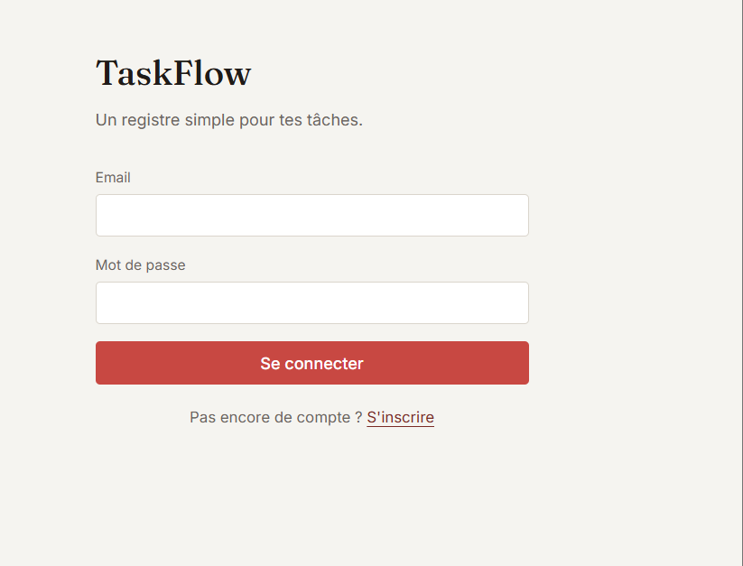
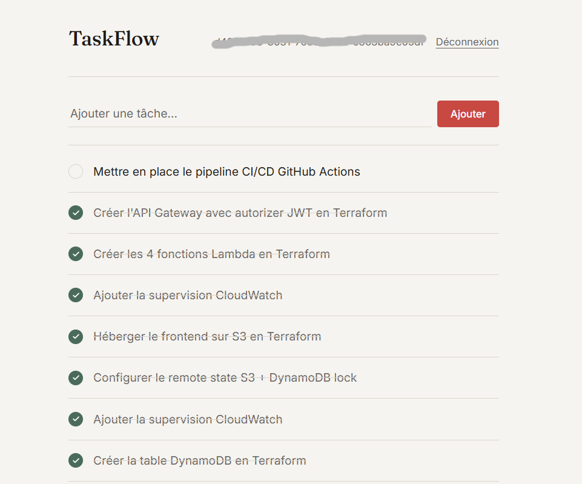
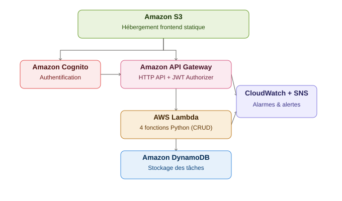
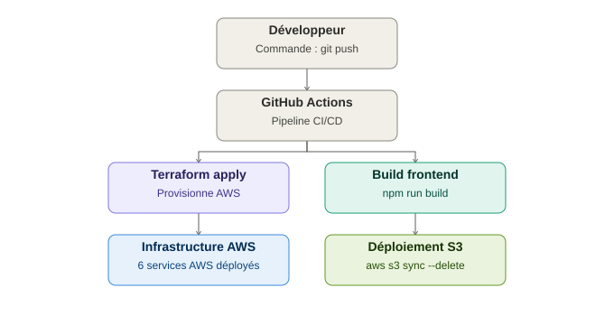

# TaskFlow

Application de gestion de tâches serverless sur AWS, déployée entièrement en Infrastructure as Code (Terraform) avec un pipeline CI/CD automatisé.

> Projet personnel réalisé pour mettre en pratique les compétences AWS Solutions Architect Associate et DevOps (Terraform, CI/CD, sécurité cloud), avec une contrainte budgétaire stricte de moins de 10$/mois.

---

## Aperçu

 
  

TaskFlow permet à un utilisateur de créer un compte, se connecter, et gérer une liste de tâches personnelles (création, suivi, suppression). L'accent du projet est mis sur l'architecture cloud, l'automatisation du déploiement, et les bonnes pratiques de sécurité — pas sur la complexité fonctionnelle de l'application elle-même.

---

## Architecture

```
Utilisateur
   │
   ▼
S3 (frontend React statique)
   │
   ▼
Cognito (authentification) ──► API Gateway (HTTP API + JWT Authorizer)
                                   │
                                   ▼
                              Lambda (4 fonctions Python)
                                   │
                                   ▼
                              DynamoDB (stockage des tâches)

CloudWatch + SNS ──► surveille les Lambdas et l'API, alerte par email en cas d'erreur
```

**Flux d'une requête :** le frontend (hébergé sur S3) authentifie l'utilisateur via Cognito, puis appelle l'API Gateway avec un token JWT. L'API Gateway vérifie ce token avant d'invoquer la fonction Lambda correspondante, qui lit/écrit dans DynamoDB.





---

## Stack technique

| Catégorie | Technologies |
|---|---|
| **Frontend** | React (Vite), amazon-cognito-identity-js |
| **Backend** | AWS Lambda (Python 3.12) |
| **Base de données** | Amazon DynamoDB (mode On-Demand) |
| **Authentification** | Amazon Cognito (User Pool + JWT) |
| **API** | Amazon API Gateway (HTTP API) |
| **Hébergement frontend** | Amazon S3 (static website hosting) |
| **Infrastructure as Code** | Terraform (backend S3 + verrouillage DynamoDB) |
| **CI/CD** | GitHub Actions |
| **Supervision** | Amazon CloudWatch (alarmes) + SNS (alertes email) |

---

## Fonctionnalités

- Inscription et connexion sécurisées (Amazon Cognito)
- Création, consultation, mise à jour et suppression de tâches (CRUD complet)
- Isolation des données par utilisateur (chaque utilisateur ne voit que ses propres tâches)
- API protégée par un JWT Authorizer (aucun accès sans authentification)
- Déploiement entièrement automatisé via Terraform et GitHub Actions
- Alertes email automatiques en cas d'erreur applicative (CloudWatch + SNS)

---

## Infrastructure as Code

Toute l'infrastructure AWS est définie en Terraform, sans aucune ressource créée manuellement dans la console :

```
terraform/
├── provider.tf          # Configuration du provider AWS + backend S3
├── variables.tf         # Variables du projet
├── dynamodb.tf          # Table DynamoDB
├── iam.tf                # Rôle et policies IAM (least privilege)
├── lambda.tf             # 4 fonctions Lambda
├── cognito.tf            # User Pool et App Client
├── api_gateway.tf        # API Gateway HTTP + JWT Authorizer
├── frontend_hosting.tf   # Bucket S3 pour le frontend
├── monitoring.tf         # Alarmes CloudWatch + topic SNS
└── outputs.tf            # URLs et identifiants générés
```

**Le state Terraform est stocké à distance sur S3** (avec verrouillage via DynamoDB), permettant au pipeline CI/CD et à l'environnement local de partager la même source de vérité.

---

## CI/CD

Un pipeline GitHub Actions (`.github/workflows/deploy.yml`) se déclenche à chaque `push` sur `main` et exécute deux jobs :

1. **`terraform`** : valide, planifie et applique l'infrastructure AWS
2. **`frontend`** : génère la configuration, build le frontend React, et le déploie sur S3

Aucune étape manuelle n'est nécessaire entre un changement de code et sa mise en production.

---

## Sécurité

- Aucune clé AWS personnelle utilisée en CI/CD — un utilisateur IAM dédié (`taskflow-github-actions`) est utilisé, avec ses identifiants stockés en tant que secrets chiffrés GitHub
- Permissions IAM appliquées selon le principe du moindre privilège (chaque Lambda n'a accès qu'à la table DynamoDB nécessaire, via son ARN exact)
- Toutes les routes de l'API sont protégées par un JWT Authorizer Cognito
- Aucun secret n'est commité dans le dépôt (fichier `.gitignore` couvrant `terraform.tfstate`, `config.js`, `terraform.tfvars`)
- MFA activé sur le compte root et le compte administrateur IAM

---

## Coût

Architecture conçue pour rester dans les paliers "always free" d'AWS (Lambda, DynamoDB, Cognito, SNS, CloudWatch), sans utiliser de ressources facturées au temps (pas d'EC2, RDS, ou NAT Gateway).

**Coût mensuel réel observé : inférieur à 1$**, avec une alerte AWS Budgets configurée à 8$ par sécurité.

---

## Ce que ce projet démontre

- Conception d'une architecture serverless complète sur AWS
- Infrastructure as Code avec gestion d'un state partagé (remote backend)
- Mise en place d'un pipeline CI/CD de bout en bout
- Application des principes de sécurité cloud (IAM least privilege, JWT, secrets management)
- Supervision applicative avec alertes automatisées
- Gestion rigoureuse des coûts dans un contexte de budget contraint

---

## Auteur

Projet réalisé par Bouchra dans le cadre d'une pratique des compétences AWS et DevOps.
